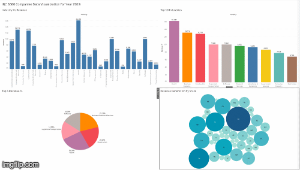

## TABLEAU - DATA ANALYSIS

### Background
Inc. 5000 is a magazine publication that rank the most fastest-growing privately held Companies in America, according to percentage revenue growth by the year.

### Purpose
Provide Data Analysis about Companies ranked in the year 2019.

### Dataset
- inc5000-2019.csv

### Description
1. Extract and transform data using Python.
2. Export and load data to PostgreSQL
3. Performance Analysis and Visualization in Tableau
